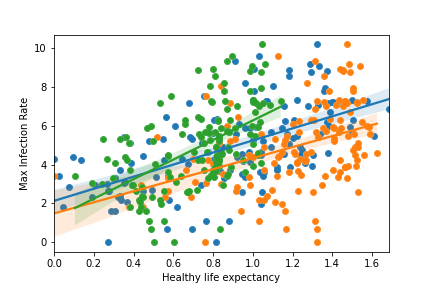

# COVID-19 Data Visualization

Using COVID-19 infection data, consolidating it, and cross referencing against the World Happiness Index data, I was able to compare various data points to understand correlation between infection rates with GDP, Life Expectancy, and Social Support.

To consolidate and shape data I used Python.
Pandas was used for initial reading and framing of csv data.
Seaborn and matplotlib were used for data visualization.
Numpy was used for some simple mathematical formatting of data.
Jupyter was also used for quick visualization within my IDE, VSCode.

Results were as follows:

As you can see, While all have some correlation to increased infection rates (possibly due to poorer testing numbers in poor countries), a higher life expectancy leads to more infections (as the virus targets more elderly), regardless of GDP or Social Support offered.

